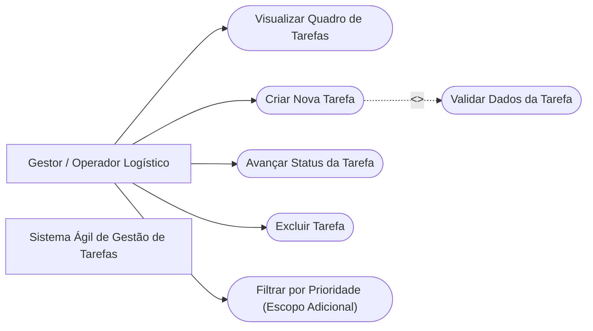
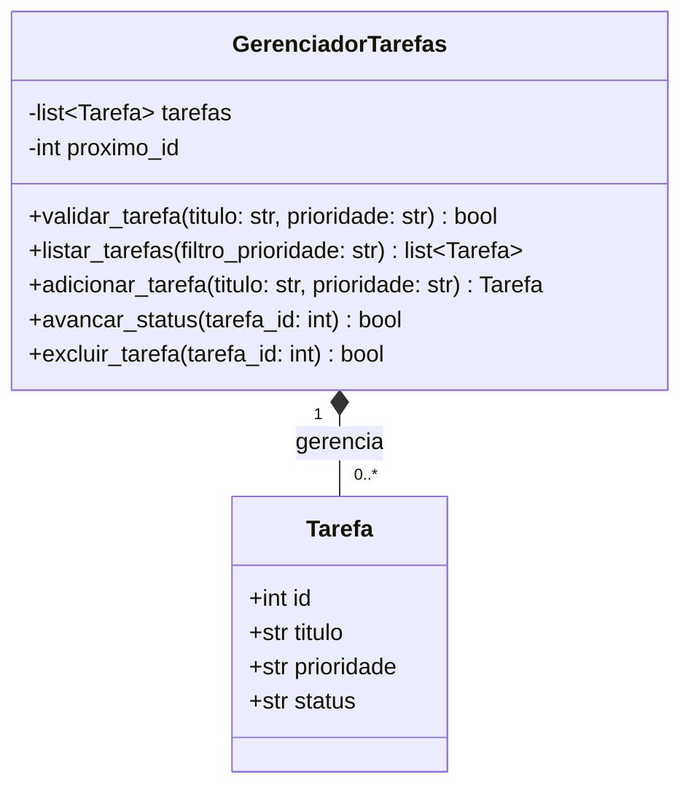

# Diagramas UML - TechFlow Solutions

## 1. Diagrama de Casos de Uso

```mermaid
flowchart LR
    Gestor["Gestor / Operador Logístico"]
    Sistema["Sistema Ágil de Gestão de Tarefas"]

    Gestor --> UC1(["Visualizar Quadro de Tarefas"])
    Gestor --> UC2(["Criar Nova Tarefa"])
    Gestor --> UC3(["Avançar Status da Tarefa"])
    Gestor --> UC4(["Excluir Tarefa"])
    Gestor --> UC5(["Filtrar por Prioridade (Escopo Adicional)"])
    UC2 -.->|"<<include>>"| UC6(["Validar Dados da Tarefa"])
```

## 2. Diagrama de Classes

```mermaid
classDiagram
    class Tarefa {
        +int id
        +str titulo
        +str prioridade
        +str status
    }

    class GerenciadorTarefas {
        -list~Tarefa~ tarefas
        -int proximo_id
        +validar_tarefa(titulo: str, prioridade: str) bool
        +listar_tarefas(filtro_prioridade: str) list~Tarefa~
        +adicionar_tarefa(titulo: str, prioridade: str) Tarefa
        +avancar_status(tarefa_id: int) bool
        +excluir_tarefa(tarefa_id: int) bool
    }

    GerenciadorTarefas "1" *-- "0..*" Tarefa : gerencia
```
